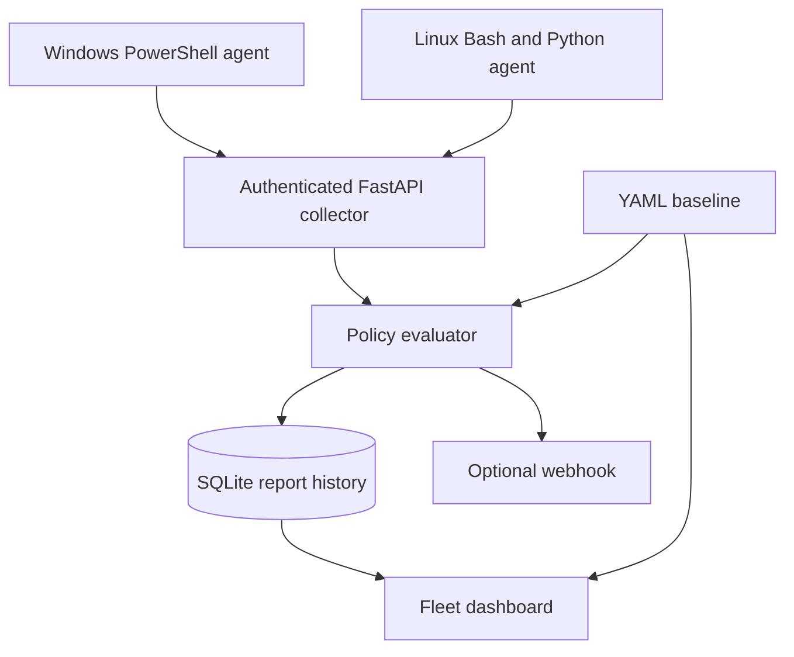

# Cross-Platform Endpoint Compliance Agent

> **v1.0 implementation complete — release checks in progress.** A working portfolio/lab project for Windows and Linux endpoint monitoring.

[](https://github.com/alamsanan1-byte/Endpoint-compliance-agent/actions/workflows/ci.yml)

Collect eight endpoint security signals, evaluate them against a central YAML baseline, and inspect device scores, configuration drift and report history in a fleet dashboard. PowerShell and Bash/Python agents collect **raw facts**; the FastAPI collector owns the policy and compliance verdicts.

The project includes working agents, authenticated ingestion, SQLite history, a dashboard, webhook debounce, synthetic examples, scheduling templates, Docker deployment and automated verification. It does not claim enterprise certification or production readiness.

## Run the demo in five minutes

Requires Python 3.12. Run these commands from the repository root:

```bash
python -m venv .venv
source .venv/bin/activate
python -m pip install -r requirements-dev.lock
export API_KEY="$(python -c 'import secrets; print(secrets.token_urlsafe(32))')"
python -m uvicorn collector.api:app --host 127.0.0.1 --port 8000
```

On Windows PowerShell, activate and set the key with:

```powershell
.venv\Scripts\Activate.ps1
python -m pip install -r requirements-dev.lock
$env:API_KEY = python -c "import secrets; print(secrets.token_urlsafe(32))"
python -m uvicorn collector.api:app --host 127.0.0.1 --port 8000
```

Keep that terminal running. In another activated terminal, set `API_KEY` to the **same** secret and run:

```bash
python -m scripts.generate_fake_fleet --count 50 --send
```

Open **http://127.0.0.1:8000**, enter your key, and select **Connect fleet**. You will see 20 compliant, 10 non-compliant, 10 warning and 10 unknown devices. Every `DEMO-*` endpoint is synthetic; this does not represent 50 physical devices.

To run a disposable demo without starting a server:

```bash
python -m scripts.smoke_test
```

## What is implemented

- [x] Windows agent: BitLocker plus seven further controls
- [x] Linux agent with the same typed JSON contract
- [x] JSON Schema validation and known-good / known-bad examples
- [x] Authenticated FastAPI `POST /reports`
- [x] SQLite report history, idempotent submission and out-of-order handling
- [x] Centrally configured scoring, with distinct failure and collection-error states
- [x] Fleet dashboard, search, state filters, evidence and device history
- [x] Policy changes immediately reflected in fleet views
- [x] Optional HTTPS webhook alerts with persistent debounce
- [x] Windows Task Scheduler and Linux systemd templates
- [x] Docker Compose deployment with a non-root collector
- [x] GitHub Actions for Python/Linux, Windows PowerShell and Docker

Verification evidence and platform limits: [docs/VALIDATION.md](docs/VALIDATION.md).

## Architecture



Each report stores the original facts, collection/receipt timestamps, ingestion-time evaluation and policy hash. Fleet views re-evaluate the newest facts against the current baseline. Historical evaluations remain unchanged so policy changes do not rewrite past evidence. The hash identifies a policy; it is not a report signature.

## Endpoint controls and collection scope

| Control | Windows source | Linux source |
|---|---|---|
| Disk encryption | OS drive BitLocker protection enabled **and** 100% encrypted | Root block-device ancestry must pass through `crypt` on every path |
| Patch age | Most recent installed `Get-HotFix` date | Completed apt install/upgrade history; RPM installation timestamp |
| Firewall | Domain, Private and Public profiles enabled | Active `ufw` or `firewalld` |
| Antivirus | Defender service, antivirus, real-time protection and signature age | ClamAV daemon state and signature age |
| Local administrators | Built-in Administrators group SID; domain names preserved | UID 0 accounts plus primary/supplementary `sudo` and `wheel` members |
| Screen lock | Machine-wide `InactivityTimeoutSecs` policy | GNOME idle delay plus lock delay; explicit headless exemption |
| Pending reboot | CBS, Windows Update and pending file rename flags | Debian reboot-required marker; RPM `needs-restarting -r` |
| Software blocklist | Machine-wide installed application registry names | Installed dpkg/RPM package names |

Patch age is a **recency proxy**, not proof that all security updates are installed. Linux administrator inventory does not parse custom sudoers or polkit rules. Software inventory excludes portable applications, Windows per-user/MSIX installs and Linux Flatpak/Snap. These boundaries are intentional and documented in [docs/OPERATIONS.md](docs/OPERATIONS.md).

## Run an agent

The agents only inspect configuration; they never enable encryption, change firewall rules, install patches or remove software. Local JSON output is available even without the collector.

**Windows 10/11 or Windows Server, 64-bit Windows PowerShell 5.1+:**

```powershell
# Use an elevated PowerShell session for privileged probes.
.\agents\windows\check.ps1 -OutputPath "$env:TEMP\endpoint-report.json"
# Set API_KEY and COLLECTOR_URL first; HTTPS is required for remote collectors.
.\agents\windows\check.ps1 -Send -OutputPath "$env:TEMP\endpoint-report.json"
```

**Linux, Python 3.10+ and Bash:**

```bash
# Run with appropriate permissions. No Python packages are required on the endpoint.
bash agents/linux/check.sh --output /tmp/endpoint-report.json
# Use --headless only for an actual server without an interactive desktop.
bash agents/linux/check.sh --headless --send --output /tmp/endpoint-report.json
```

A permission problem, missing command or unsupported provider produces `error`, not a fabricated pass. A Linux desktop must be inspected in the relevant GNOME user's session; a root/systemd process cannot prove the user's screen-lock settings. The headless exception is allowed only where the central policy explicitly permits it.

Agents generate a stable pseudonymous device ID from the machine ID; use `--device-id` / `-DeviceId` for enrolled lab names. Hostnames, local account names and installed software are still sensitive inventory. Keep real reports out of Git.

## Policy and scoring

Edit [policy/baseline.yaml](policy/baseline.yaml). The collector validates and reloads it on each ingestion/fleet request. A configuration error rejects the request with `503`; it does not silently use a permissive fallback.

- Weights: critical **4**, high **3**, medium **2**, low **1**.
- `pass` earns full weight; `warn` earns half; `fail` and `error` earn zero.
- Approved `not_applicable` checks are excluded from the denominator.
- Score = earned weight / applicable weight × 100.
- A critical failure always means `non_compliant`. Other failures below the configured threshold also mean `non_compliant`.
- Remaining collection errors mean `unknown`, even if the numeric score would meet the threshold.
- Above-threshold failures/warnings remain visible as `warning`; they never appear fully compliant.
- Stale devices are counted separately, regardless of their last score.

The agent's `status: pass` means a probe returned facts successfully, **not** that the endpoint meets policy. The collector independently evaluates the typed `value`. Agent-supplied pass/fail/warn verdicts cannot override those facts. Missing checks become errors; duplicate check IDs are rejected.

Default threshold: 90%; patch recency: 30 days; signatures: 3 days; lock timeout: 15 minutes. The sample blocklist contains the synthetic name `demo-blocked-app`. Review allowlists and thresholds for your lab before using real agents.

## API

All data routes require `Authorization: Bearer <API_KEY>`. The collector refuses startup with a key shorter than 24 characters. The public routes expose only health and the empty dashboard shell/assets. The dashboard keeps its key in memory, not browser storage.

| Method and path | Purpose |
|---|---|
| `GET /health` | Public readiness/version response |
| `POST /reports` | Validate, evaluate and store raw facts; `201` new or `200` duplicate |
| `GET /fleet` | Latest devices, current policy scores and stale counts |
| `GET /devices/{device_id}/history?limit=50` | Original reports and evaluations; maximum 200 |
| `GET /policy` | Current validated baseline |

Reports older than 24 hours or more than 5 minutes ahead are rejected by default. Maximum body size is 512 KiB. Identical evidence is not stored twice. Older accepted reports stay in history but cannot replace newer device state or trigger current-state alerts.

## Docker, scheduling and alerts

```bash
cp .env.example .env
# Put a generated API_KEY in .env; leave WEBHOOK_URL empty for the demo.
docker compose up --build -d
```

The published port binds to loopback. A named volume preserves SQLite data; policy is mounted read-only. Use `docker compose down` to stop while preserving the database. A remote deployment requires a TLS reverse proxy and additional hardening.

See [docs/OPERATIONS.md](docs/OPERATIONS.md) for systemd, Windows Task Scheduler, offline reports and webhook setup. Alerts are disabled until you configure an HTTPS URL. They are debounced per device and control-state signature, survive restarts and retry failed delivery on the next fresh report. Alert delivery is best-effort, not a durable message queue.

## Verify it

```bash
python -m pip install -r requirements-dev.lock
ruff check .
ruff format --check .
pytest -q
python -m scripts.smoke_test
python -m scripts.validate_report tests/fixtures/windows-good.json tests/fixtures/linux-good.json
```

On Windows:

```powershell
.\tests\test_windows_agent.ps1
python -m scripts.validate_report output/windows-test.json output/windows-error-test.json
```

CI also collects a live report on hosted Linux and Windows runners, validates the contract and builds/starts the container. Hosted CI cannot prove BitLocker/LUKS behaviour across every real device; controlled fixtures test those decision branches. The supported use is a portfolio/lab demonstration.

## Repository map

| Path | Purpose |
|---|---|
| `agents/` | Read-only endpoint probes and scheduled Windows runner |
| `collector/` | API, policy evaluator, SQLite store, alerts and dashboard |
| `schema/` | Typed report contract and validated policy definition |
| `policy/` | Example baseline |
| `scripts/` | Synthetic fleet, disposable smoke test, report validator |
| `tests/` | Behaviour tests, synthetic fixtures and Windows probe tests |
| `deployment/` | systemd timer/service and Windows task registration |
| `.github/workflows/ci.yml` | Linux/Python, Windows and container gates |

## Security and further development

This is a finished **v1.0 lab scope** with explicitly bounded collection support. See [SECURITY.md](SECURITY.md). It does not provide per-device identity, signed evidence, endpoint attestation, role-based access, high availability, queue-backed alert guarantees or organisation-specific compliance certification. A shared key can forge any device ID. Do not expose the collector directly to the public internet.

Possible later versions can add mTLS, separate agent/viewer permissions, PostgreSQL, durable alert delivery, broader OS providers and managed agent rollouts. Those extensions are outside the completed v1.0 scope.
