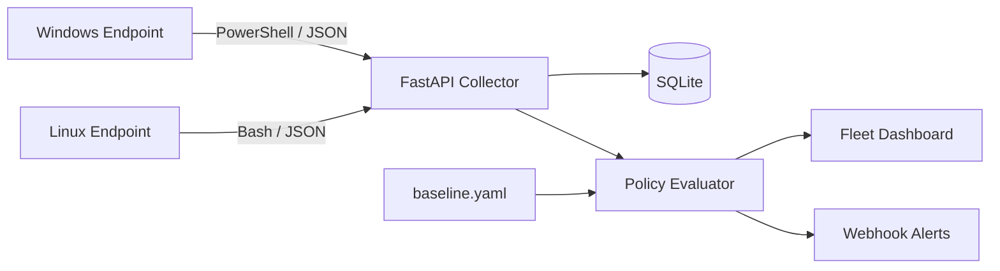

# Cross-Platform Endpoint Compliance Agent

> **Status: In Development**

A cross-platform endpoint compliance project for auditing Windows and Linux devices against a configurable security baseline and reporting fleet-wide configuration drift.

## Problem

Enterprise IT and security teams need reliable visibility into whether endpoints continue to meet requirements such as disk encryption, patching, firewall configuration, antivirus health, privileged-account restrictions and screen-lock settings.

Manual checks do not scale, and endpoint configuration can drift between formal audits. This project is designed to automate collection of endpoint facts, evaluate them centrally against policy and make non-compliant devices easier to identify and investigate.

## Target Architecture



### Design principle: collect facts, evaluate centrally

The Windows and Linux agents collect raw system facts. They do not own the compliance policy.

The collector evaluates those facts against `policy/baseline.yaml`. This means a threshold such as maximum patch age can be changed centrally without modifying or redeploying every endpoint script.

## Technology Stack

- **PowerShell** — Windows endpoint collection
- **Bash** — Linux endpoint collection
- **Python / FastAPI** — report ingestion and policy evaluation
- **YAML** — configurable security baseline
- **JSON / JSON Schema** — shared cross-platform reporting contract
- **SQLite** — device state and compliance history for the lab version
- **pytest** — automated testing
- **Docker / Docker Compose** — collector deployment
- **GitHub Actions** — linting and test automation

## Endpoint Checks

| Check | Windows | Linux |
|---|---|---|
| Disk encryption | `Get-BitLockerVolume` | LUKS via `lsblk` / `cryptsetup` |
| Patch level | `Get-HotFix` | `apt` / `dnf` update history |
| Firewall | `Get-NetFirewallProfile` | `ufw` / `firewall-cmd` |
| Antivirus | Microsoft Defender | ClamAV where applicable |
| Local administrators | Administrators group | `sudo` / `wheel` membership |
| Screen lock | Registry inactivity settings | `gsettings` idle delay |
| Pending reboot | Reboot-required registry keys | `/var/run/reboot-required` |
| Unauthorised software | Installed apps vs blocklist | `dpkg` / `rpm` vs blocklist |

Each check is designed to return one of:

- `pass` — policy requirement met
- `fail` — endpoint inspected successfully but does not meet policy
- `warn` — requires attention but is not a hard failure
- `error` — the check itself could not be completed
- `not_applicable` — the control genuinely does not apply on the platform

`error` and `fail` are intentionally different states.

## Shared Reporting Contract

Both agents are designed to emit the same JSON shape so the collector remains platform-agnostic.

```json
{
  "device_id": "LAB-WIN-01",
  "hostname": "windows-lab-01",
  "os": "windows",
  "os_version": "11",
  "collected_at": "2026-09-19T14:03:11Z",
  "agent_version": "1.0.0",
  "checks": [
    {
      "id": "disk_encryption",
      "status": "pass",
      "value": "BitLocker enabled",
      "detail": null
    }
  ]
}
```

All examples in this repository use **lab or synthetic data only**.

## Policy Model

Security requirements are stored in configuration rather than hard-coded into endpoint scripts.

```yaml
version: 1
baseline:
  disk_encryption:
    required: true
    severity: critical
  patch_level:
    max_days_since_update: 30
    severity: high
  firewall:
    required: true
    severity: high
  screen_lock:
    max_timeout_minutes: 15
    severity: medium

compliance_threshold: 90
```

## Repository Structure

```text
Endpoint-compliance-agent/
├── agents/
│   ├── windows/check.ps1
│   └── linux/check.sh
├── collector/
│   ├── api.py
│   ├── db.py
│   ├── evaluate.py
│   └── alert.py
├── policy/
│   └── baseline.yaml
├── schema/
│   └── report.schema.json
├── tests/
├── scripts/
│   └── generate_fake_fleet.py
├── .github/workflows/
├── docker-compose.yml
└── README.md
```

## Build Roadmap

- [ ] Windows agent with BitLocker check
- [ ] Remaining Windows compliance checks
- [ ] Linux agent matching the shared JSON contract
- [ ] JSON Schema validation for both agents
- [ ] FastAPI `POST /reports` ingestion endpoint
- [ ] SQLite persistence with report history
- [ ] YAML-driven compliance evaluation
- [ ] Known-good and known-bad test fixtures
- [ ] Fleet compliance dashboard
- [ ] Webhook alerting with debounce
- [ ] Windows Task Scheduler configuration
- [ ] Linux cron/systemd scheduling
- [ ] Docker Compose deployment
- [ ] GitHub Actions lint and test workflow

## Tests That Matter

The intended test suite focuses on behaviour rather than coverage percentage alone.

- Windows and Linux reports validate against the same JSON Schema
- A known failing report produces the expected compliance score
- `error` is handled separately from `fail`
- Changing policy changes scoring without changing application code
- Repeated failing runs do not generate duplicate alerts

## Lab Environment

The project is intended to be demonstrated using:

- Windows 11 evaluation VM
- Ubuntu VM
- VirtualBox
- synthetic fleet reports generated with Python

A synthetic 50-device fleet may be used for dashboard demonstrations. Synthetic reports do **not** represent 50 physical devices.

## Security Considerations

A production deployment would require additional controls such as:

- authenticated agents
- TLS-protected transport
- device identity and certificate management
- signed or otherwise integrity-protected reports
- secrets management
- role-based dashboard access
- central endpoint deployment and upgrade controls
- controls against compromised endpoints falsely reporting compliance

See [`SECURITY.md`](SECURITY.md) for repository-specific guidance.

## Current Limitations

This repository is an active engineering project, not a production endpoint-management platform. The initial lab architecture uses SQLite for simplicity and does not yet represent the authentication, scale or operational controls required for an enterprise deployment.

## What This Project Demonstrates

- endpoint management concepts
- Windows administration with PowerShell
- Linux administration with Bash
- Python automation and API development
- configuration-driven security controls
- cross-platform interface design
- automated testing
- compliance engineering
- security monitoring
- safe use of synthetic data
- technical documentation

## Interview Topics

The finished project is designed to support discussion around:

- Why collect facts on the endpoint but evaluate policy centrally?
- What happens when an agent cannot reach the collector?
- How would this architecture change for 5,000 endpoints?
- How can false compliance reports from compromised agents be reduced?
- Why is `error` different from `fail`?
- How should policy changes be versioned and audited?

## Future Improvements

Potential extensions after the core build include:

- PostgreSQL for larger-scale storage
- certificate-based agent authentication
- cryptographically signed reports
- Intune or other endpoint-management integration
- Microsoft Defender integration
- role-based dashboard access
- richer compliance trend and drift analytics
- central agent deployment and upgrade management

## Development Approach

This project is being built incrementally. Each meaningful feature should be implemented, tested and committed separately so the repository history reflects the engineering process rather than a single finished-code upload.

No production employer data, real employee identities, credentials or proprietary internal information should be committed to this repository.
